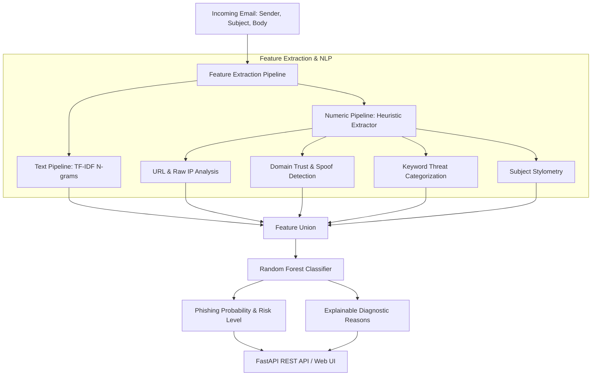

# 🛡️ AI-Powered Phishing Detection System

[](https://python.org)
[](https://fastapi.tiangolo.com)
[](https://scikit-learn.org)
[](https://tailwindcss.com)
[](https://opensource.org/licenses/MIT)

An end-to-end intelligent security system that detects and explains phishing threats in emails using Machine Learning and NLP heuristics. The pipeline analyzes sender credibility, URL patterns, keyword vectors, and lexical structures to provide real-time classifications with threat probabilities and explainable diagnostic reasons.

---

## 🚀 Key Features

* **Dual-Engine Feature Pipeline**: Combines TF-IDF N-gram text vectorization with scikit-learn custom heuristic transformers.
* **Explainable AI Diagnostics**: Every scan outputs specific reasons (e.g., suspicious URL patterns, brand impersonation, high-risk TLDs, urgent keywords, ALL-CAPS subject lines).
* **Interactive Modern UI**: Dark-themed web dashboard with 1-click test presets, dynamic risk gauge, sensitivity threshold slider, and live health monitoring.
* **High-Performance FastAPI Backend**: Async REST endpoints for single and batch predictions, health checks, and interactive Swagger documentation.
* **Lightweight & Portable**: Easy to train, export, and run locally without requiring heavyweight GPU dependencies.

---

## 🏗️ Architecture Overview



---

## 📂 Project Structure

```text
AI-Powered-Phishing-Detection/
├── custom_transformers.py   # Custom scikit-learn transformers & heuristic extractors
├── model_training.py        # Dataset, training pipeline, evaluation & model persistence
├── main.py                  # FastAPI server with single/batch endpoints & health checks
├── index.html               # Modern responsive frontend dashboard (Tailwind CSS)
├── phish_model.pickle       # Serialized Random Forest ML model artifact
├── requirements.txt         # Python project dependencies
├── .gitignore               # Ignored runtime & editor files
├── LICENSE                  # MIT License
└── README.md                # Project documentation
```

---

## ⚡ Quick Start

### 1. Clone the Repository
```bash
git clone https://github.com/harshitthek/AI-Powered-Phishing-Detection.git
cd AI-Powered-Phishing-Detection
```

### 2. Install Dependencies
```bash
pip install -r requirements.txt
```

### 3. (Optional) Train / Retrain Model
To train the machine learning pipeline from scratch:
```bash
python model_training.py
```

### 4. Start the API Server
```bash
python main.py
```
The API server will start at `http://127.0.0.1:8000`.

### 5. Launch the Web Interface
Simply open `index.html` in your web browser or use VS Code Live Server.

---

## 📡 API Reference

### 🔹 Health Check
`GET /health`
```json
{
  "status": "healthy",
  "model_loaded": true,
  "model_path": "C:\\...\\phish_model.pickle"
}
```

### 🔹 Single Email Prediction
`POST /predict`

**Request Body:**
```json
{
  "sender": "security-alert@paypal-update-center.net",
  "subject": "URGENT: Your PayPal Account Has Been Suspended",
  "email_text": "Click http://paypal-security-verification.net/login immediately to verify your identity.",
  "threshold": 0.5
}
```

**Response:**
```json
{
  "label": "Phishing",
  "probability": 0.88,
  "risk_level": "High",
  "reasons": [
    "Contains 1 embedded URL(s)",
    "Link uses a high-risk suspicious top-level domain (TLD)",
    "Brand impersonation detected: Subject mentions 'Paypal' but sender is '@paypal-update-center.net'",
    "Urgent/Phishing keywords detected: 'urgent', 'verify', 'account', 'suspended'"
  ]
}
```

### 🔹 Interactive Swagger UI
Access the interactive OpenAPI Swagger UI at `http://127.0.0.1:8000/docs` to test all endpoints directly in your browser.

---

## 🧪 Model Features & Evaluation

| Feature Group | Description |
| :--- | :--- |
| **TF-IDF N-grams** | Sublinear TF-IDF text features across unigram and bigram tokens (max 2,500 features). |
| **URL Signals** | Count of URLs, presence of raw IP addresses, URL shorteners, and suspicious TLDs (`.xyz`, `.top`, `.online`, etc.). |
| **Sender Verification** | Trusted enterprise domain matching, domain spoofing detection, and brand mismatch identification. |
| **Urgency Indicators** | Frequency of high-risk threat terms (account locked, immediate action, wire transfer, gift card prize). |
| **Stylometry** | Uppercase ratio in subject headers and excessive punctuation signals (`!`, `?`). |

---

## 📄 License

This project is licensed under the MIT License - see the [LICENSE](LICENSE) file for details.

---

## 👨‍💻 Author

Developed with ❤️ by **[Harshit Sharma](https://github.com/harshitthek)**
