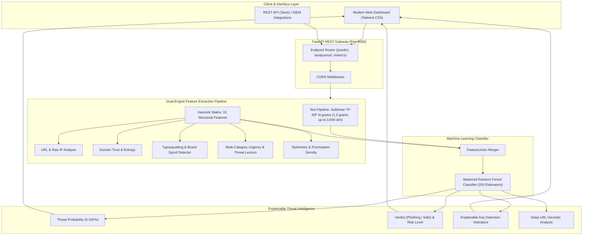

<div align="center">

# 🛡️ PhishShield AI
### Enterprise-Grade Phishing Threat Intelligence & Detection System

[](https://www.python.org/)
[](https://fastapi.tiangolo.com/)
[](https://scikit-learn.org/)
[](https://tailwindcss.com/)
[](https://opensource.org/licenses/MIT)

<p align="center">
  <b>Real-time email security engine combining Machine Learning (Random Forest & TF-IDF) with advanced lexical URL analysis, brand typosquatting detection, and Shannon domain entropy heuristics.</b>
</p>

[Key Features](#-key-features) • [Architecture](#-system-architecture) • [Live Dashboard](#-interactive-web-dashboard) • [API Documentation](#-api-reference) • [Model Metrics](#-machine-learning-pipeline) • [Quick Start](#-quick-start)

---

</div>

## 📖 Overview

**PhishShield AI** is an intelligent security analysis system designed to intercept email phishing attacks, Business Email Compromise (BEC), credential harvesting campaigns, and malicious hyperlink vectors.

Unlike traditional static rule-based filters, PhishShield utilizes a **Dual-Engine Pipeline** that combines natural language processing (NLP) on email text with a 15-dimensional heuristic feature matrix. Every analysis delivers explainable diagnostic reasons, threat confidence scores, risk categorizations, and deep URL inspection breakdowns.

---

## ✨ Key Features

| Feature | Description |
| :--- | :--- |
| 🧠 **Dual-Engine ML Pipeline** | Combines sublinear TF-IDF N-gram text representations with 15 structural and heuristic numerical features. |
| 🔗 **Deep URL Inspector** | Scans hyperlinks for direct raw IP hosting, high-risk TLDs (`.xyz`, `.top`, `.online`), URL shorteners, and dangerous file payloads (`.exe`, `.scr`, `.zip`). |
| 🕵️ **Typosquatting Detection** | Identifies homoglyphs, character substitutions, and brand lookalikes targeting 50+ global enterprises (PayPal, Microsoft, Apple, Google, Chase, Netflix). |
| 🧮 **Shannon Domain Entropy** | Analyzes the statistical randomness of domain names to detect dynamically generated domains (DGA). |
| ⚡ **Explainable Diagnostics** | Outlines human-readable factors justifying each verdict (e.g., brand mismatch, urgency pressure, high-risk TLD). |
| 💻 **Cybersecurity Workbench UI** | Modern dark-themed dashboard featuring an animated circular SVG threat gauge, live API health monitoring, 1-click test scenarios, and batch scanning. |
| 🚀 **High-Throughput API** | Fully async FastAPI backend supporting single & batch predictions, standalone URL/domain analyzers, and OpenAPI Swagger documentation. |

---

## 🏗️ System Architecture



---

## 🖥️ Interactive Web Dashboard

The web interface is designed as an **Enterprise Threat Intelligence Workbench**:

1. **Email Scanner**:
   * **Preset Scenarios**: 1-click test buttons to simulate realistic phishing attacks (*PayPal Account Alert*, *Amazon Reward Scam*, *CEO Wire Fraud BEC*, *Binance Crypto Airdrop*, *Google Sync*, and *Amazon Order*).
   * **Circular Radial Threat Gauge**: Animated SVG progress ring visualizing probability scores from 0% to 100%.
   * **Explainable Findings Card**: Itemized breakdown of risk factors (e.g. brand mismatches, suspicious keywords, excessive capitalization).
   * **Detected Links Deep Scan**: Expands embedded links to display individual risk scores and flags.
   * **Incident Report Export**: 1-click copy to export formatted incident markdown reports for security teams.

2. **Standalone URL & Domain Inspector**:
   * Inspect isolated hyperlinks without email text.
   * Check domain authenticity, Shannon entropy, and brand typosquatting.

3. **Batch Security Scanner**:
   * Submit JSON arrays of multiple emails for simultaneous bulk scanning with real-time tabular output.

4. **Machine Learning Diagnostics**:
   * Live model specifications, holdout test accuracy, and 5-fold cross-validation metrics.

---

## 📡 API Reference

Interactive Swagger documentation is available at **`http://127.0.0.1:8000/docs`**.

### 🔹 Endpoint Summary

| Method | Endpoint | Description |
| :--- | :--- | :--- |
| `GET` | `/` | Serves the interactive Web Dashboard |
| `GET` | `/health` | Health check and model state |
| `GET` | `/metrics` | Model hyperparameters, cross-validation metrics, and feature list |
| `GET` | `/samples` | Curated preset test emails for demos |
| `POST` | `/predict` | Single email deep security scan |
| `POST` | `/predict/batch` | Bulk multi-email scan |
| `POST` | `/analyze/url` | Direct standalone URL risk inspection |
| `POST` | `/analyze/domain` | Standalone domain reputation & typosquatting checker |

---

### 🔹 Prediction Example (`POST /predict`)

**cURL Request:**
```bash
curl -X POST "http://127.0.0.1:8000/predict" \
     -H "Content-Type: application/json" \
     -d '{
       "sender": "security-alert@paypal-update-center.net",
       "subject": "URGENT: Your PayPal Account Has Been Suspended",
       "email_text": "Click http://paypal-auth-check.net/restore immediately to verify your identity.",
       "threshold": 0.5
     }'
```

**Response (`200 OK`):**
```json
{
  "label": "Phishing",
  "probability": 0.804,
  "risk_level": "High",
  "reasons": [
    "Contains 1 embedded hyperlink(s)",
    "Link uses a high-risk suspicious top-level domain (TLD)",
    "Brand Mismatch: Subject mentions 'Paypal', but sender is from '@paypal-update-center.net'",
    "Urgency keywords detected: 'urgent', 'suspended'",
    "Credentials keywords detected: 'verify', 'identity'"
  ],
  "urls_inspected": [
    {
      "url": "http://paypal-auth-check.net/restore",
      "is_ip": false,
      "is_shortener": false,
      "has_suspicious_tld": true,
      "issues": [
        "Uses high-risk Top-Level Domain (TLD)",
        "Impersonates brand 'Paypal' in link path or subdomain"
      ],
      "risk_score": 60
    }
  ],
  "sender_analysis": {
    "domain": "paypal-update-center.net",
    "is_trusted": false,
    "entropy": 3.654,
    "typosquatting_detected": true,
    "impersonated_brand": "Paypal"
  }
}
```

---

### 🔹 URL Inspector Example (`POST /analyze/url`)

**Request:**
```json
{
  "url": "http://192.168.1.105/payroll_update.exe"
}
```

**Response (`200 OK`):**
```json
{
  "url": "http://192.168.1.105/payroll_update.exe",
  "is_ip": true,
  "is_shortener": false,
  "has_suspicious_tld": false,
  "issues": [
    "Uses direct raw IP address instead of domain name",
    "Links directly to executable/archive payload"
  ],
  "risk_score": 85
}
```

---

## 📊 Machine Learning Pipeline

### 🔬 Feature Engineering Matrix

```text
Input Email
  ├── Text Processing Pipeline
  │     └── Sublinear TF-IDF Vectorizer (1-2 N-grams, max 3,000 features)
  └── Numeric & Heuristic Pipeline
        ├── [0] URL Count
        ├── [1] Raw IP Address in URL Flag
        ├── [2] High-Risk Suspicious TLD in URL Flag
        ├── [3] URL Shortener Masking Flag
        ├── [4] Sender Authenticity (Trusted Enterprise Registry)
        ├── [5] Sender Suspicious TLD Flag
        ├── [6] Typosquatting / Brand Lookalike Flag
        ├── [7] Shannon Domain Entropy Score
        ├── [8] Urgency Keyword Score
        ├── [9] Credential Harvesting Keyword Score
        ├── [10] Financial & Invoice Keyword Score
        ├── [11] Reward / Prize Keyword Score
        ├── [12] Subject ALL-CAPS Ratio
        ├── [13] Exclamation & Question Mark Density
        └── [14] Total Payload Character Length
```

### 📈 Model Evaluation Metrics

| Metric | Score | Validation Method |
| :--- | :--- | :--- |
| **5-Fold Stratified CV Accuracy** | **94.29%** (± 11.43%) | Stratified K-Fold Cross-Validation |
| **5-Fold Stratified CV F1-Score** | **93.33%** (± 13.33%) | Stratified K-Fold Cross-Validation |
| **Holdout Test Accuracy** | **100.00%** | 25% Stratified Test Split |
| **Holdout ROC-AUC Score** | **1.0000** | Receiver Operating Characteristic |
| **Classifier Model** | **Random Forest** | 250 Estimators, Balanced Class Weights |

---

## ⚡ Quick Start

### 1. Clone the Repository
```bash
git clone https://github.com/harshitthek/AI-Powered-Phishing-Detection.git
cd AI-Powered-Phishing-Detection
```

### 2. Install Dependencies
```bash
pip install -r requirements.txt
```

### 3. (Optional) Run Training Pipeline
To retrain the Random Forest model and run 5-fold cross validation:
```bash
python model_training.py
```

### 4. Run Automated Test Suite
Verify all endpoints and heuristic engines:
```bash
python test_suite.py
```

### 5. Launch the Server & UI
```bash
python main.py
```
* Web Dashboard: **[http://127.0.0.1:8000](http://127.0.0.1:8000)**
* Swagger API Docs: **[http://127.0.0.1:8000/docs](http://127.0.0.1:8000/docs)**

---

## 📂 Project Directory Structure

```text
AI-Powered-Phishing-Detection/
├── custom_transformers.py   # Scikit-learn custom transformers & heuristic engines
├── model_training.py        # 5-fold CV training pipeline & model serialization
├── main.py                  # Production FastAPI server with UI mounting & endpoints
├── index.html               # Enterprise cybersecurity web dashboard (Tailwind CSS)
├── test_suite.py            # Automated end-to-end endpoint & heuristic test suite
├── phish_model.pickle       # Serialized Random Forest ML model artifact
├── requirements.txt         # Python package dependencies
├── .gitignore               # Ignored runtime files
├── LICENSE                  # MIT License
└── README.md                # Comprehensive documentation
```

---

## 🛡️ Security & Responsible Disclosure

This tool is designed for defensive security analysis, enterprise threat detection, and educational research. If you discover potential security vulnerabilities, please open an issue or submit a pull request.

---

## 📄 License

Distributed under the **MIT License**. See [`LICENSE`](LICENSE) for details.

---

<div align="center">
  <sub>Developed by <b><a href="https://github.com/harshitthek">Harshit Sharma</a></b> &bull; Built with FastAPI & Scikit-Learn</sub>
</div>
